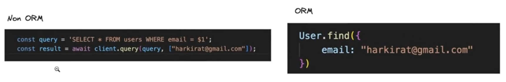
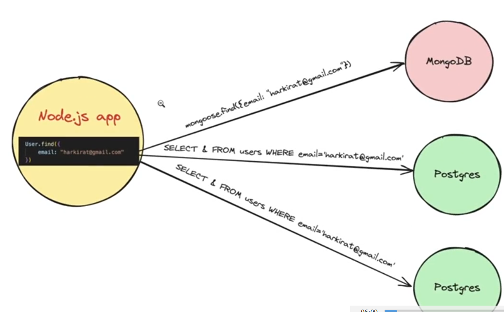
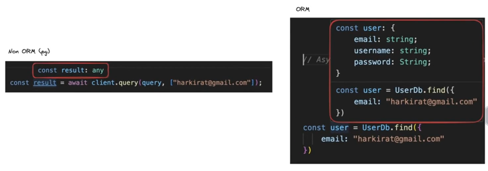
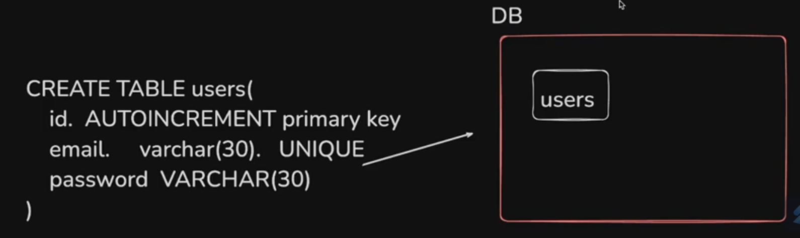
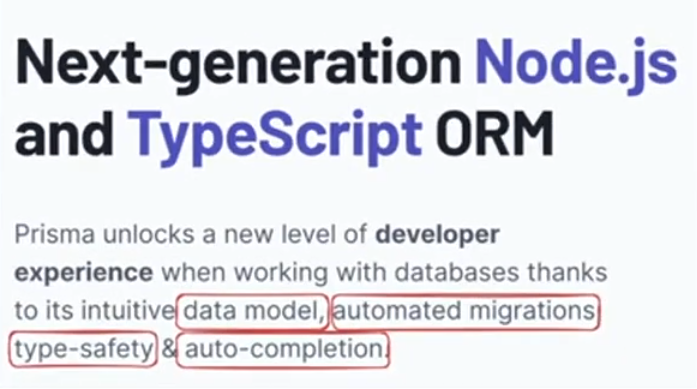

# **Prisma**

## **What are ORMs ??**

**Boring official definition**

ORM stands for __Object-Relational Mapping,__ a programming technique used in software development to __convert data between incompatible type systems in object-oriented programming languages.__ This technique creates a __`virtual object database`__ that can be used from within the programming language.

ORMS are __used to abstract the complexities of the underlying database into simpler, more easily managed objects within the code__

**Easier to digest definition**

ORMs let you __easily interact with your database without worrying too much about the underlying syntax (SQL language for eg)__(If you are using an ORMs, then lot of problem which occurs while using SQL database such as SQL injection and many others, that gets avoided)


Can you see how easy we have now made, instead of remembering the whole syntax and learning new langauge(SQl), we now have converted into **object - oriented programming** type langauge. [this is one of the benefits of ORM]

**Ex -> `mongoose` was ODM (Object document mapping)**

> :pushpin:**Basically for NoSQL, ODMs are there and for SQL ORMs are there to EASIFY things**


## **Why ORMs ??**

1. **Simpler Syntax (converts objects to SQL Queries under the hood)**
----------




2. **Abstraction that let you flip the database you are using. [Unified API irrespective of the DB]** (very very important point)
----------

    + __Interchangability__ between the database and __Interoperability__ between the database becomes **easier** (means if you are using `mongoDb` and you want to shift to `postgres`, then of course things will become difficult but only for **MIGRATION**, when it comes to `node.js` code, then you have to make very minimal change, maybe you dont have to change at all)
    + BUT Rarely you migrate database so that is not the concern but still this is the advantage of using ORMs




3. **Type Safety / Auto completion**
----------




see the type in the **Red box** in the above code. (you can see in the ORM section, vs code is auto suggesting that what all `user` type **requires**) [that is why in left pic Non-ORM one, vs code is not suggesting auto completion as its type is `any`]

4. **Automatic migrations**
----------


But before understanding the automatic migrations, first lets see 

:bulb: **What is Migrations ??**

lets say you want to make a table `users` which consists of some rows so for making it  



Now let say i have to add another field called as `age` after some time so now you will not run the above command again with `age` addition code, you will use 

```javascript
ALTER TABLE users ADD COLUMN age INTEGER
```

Now again after some more time, you have to add another field called as `dob` so again you will do the below command 

```javascript
ALTER TABLE users ADD COLUMN dob DATE
```

The above is what **Migration** means. You are **Migrating your database** (your database is getting **new columns, your database is getting altered**)

__This is very hard to track off.__ (you have done in your database but when another developer will take use of your database, then you have to send the migrations also so that they can know what change they have to make as per the latest).

-> so for this you must have a folder named `migrations` to store all the migration which has been done so that every one can know about it and use it to get the correct output.

**The above is the reason you should also use `ORMs` as these `migrations` are automatically being handled by the `ORMs` so you need not to worry about this**

As your app grows, you will have a lot of these `CREATE` and `ALTER` commands.

__ORMs (or more specifically Prisma) maintains all of these for you.__

For example -> https://github.com/code100x/cms/tree/main/prisma/migrations

all the `migration` you are seeing by clicking on the above link, you will get to know that all these `migration` has been **automatically generated**(Notice it has TIMESTAMP of creation included consisting of Year(first four no.), Month(next 2 no.), Date(next 2 no.), Time(rest no.))

In case of a simple Postgres app. it's __very hard to keep track of all the commands that were ran that led to the current schema of the table.__

## **What is Prisma ??**

If you see to their website they have written something about it which states 4 things (highlighted by red box) basically :-



1. **Data Model**
----------
__In a single file, define your schema.__ What it looks like, what tables you have,
what field each table has, how are rows related to each other.

2. **Automated Migrations**
----------


