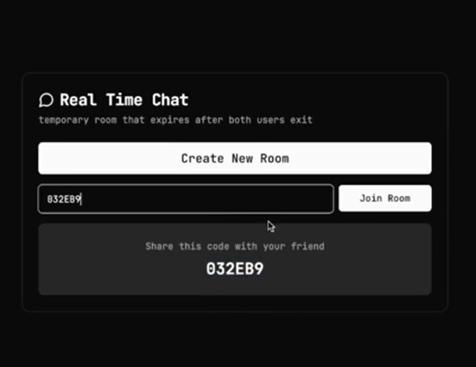
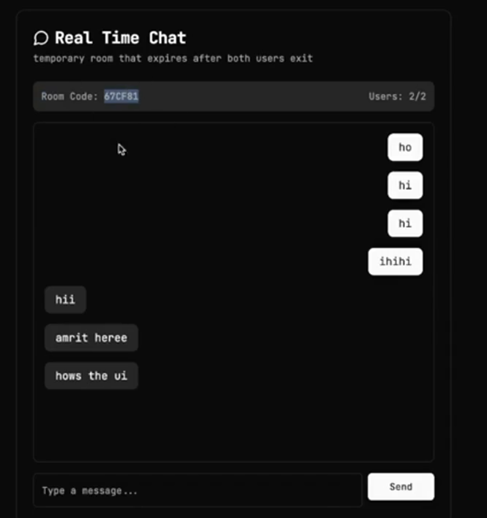
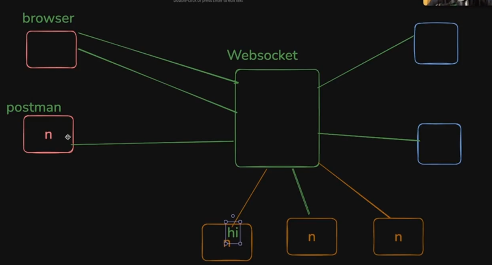
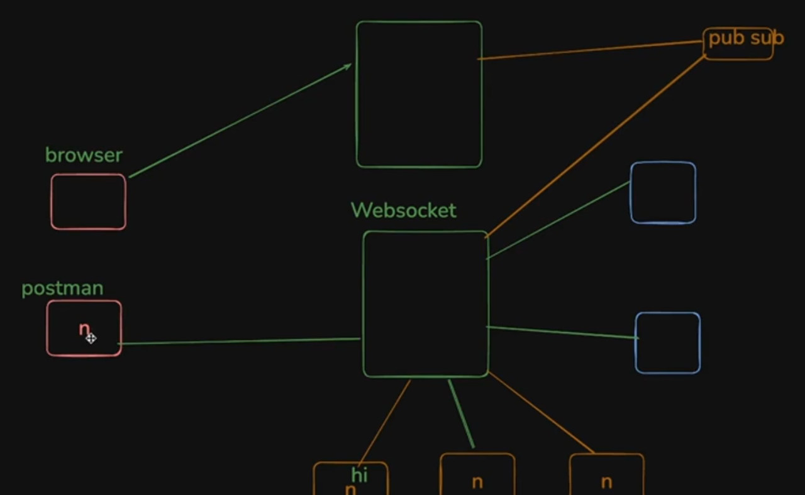
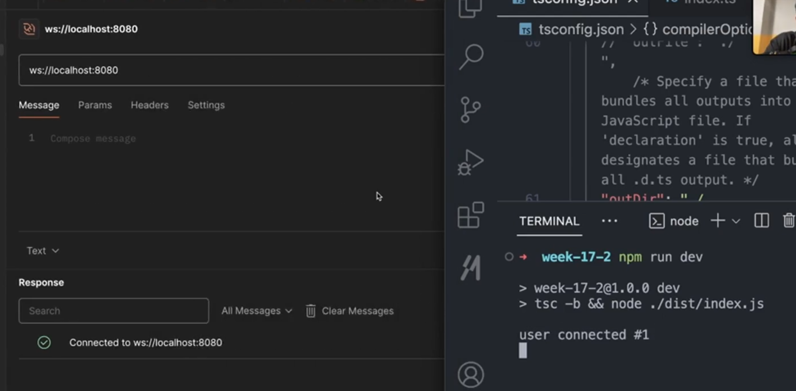
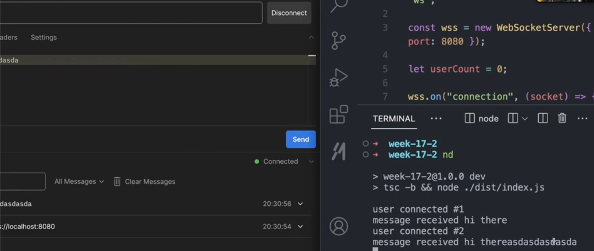
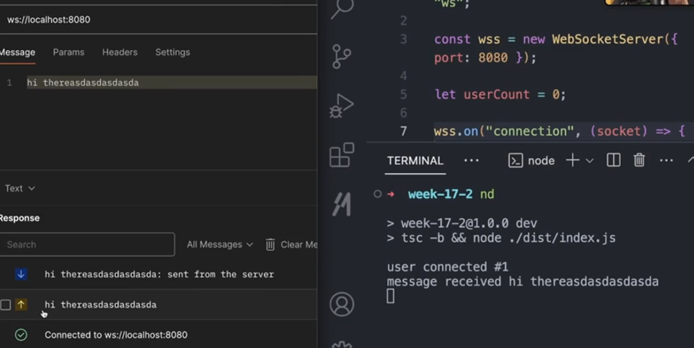

# **Building real time chat app**

Now if you have understood the previous class then only proceed otherwise dont try to follow along

what we are building today 

  

**Whats new in this project or challenges**

The major challenge which you will face is see the below pic



although all the ROOMS (ornage, blue, red box) are connected to the same websocket server still the message present inside one room should not go to other different room but at the same time, it also should have the capability to brodacast among all the members present inside one particular room 

-> message comes from room 1 should go to everyone in room 1 only and so on with other room

If you can do the above task then **advanced version of this assignment ->** create multiple websocket server, and try to distribute the traffic(lets say put some user of room 1 connect to this websocket server and then interact with others among the room 1) among multiple websocket server made (randomly distribute it) and connect all the websocket server to the PUB SUB(read about this how it works)

architecture looks something like this :-



do all the steps present in the previous websocket pdf to initialise an empty project 

inside the `index.ts`

```javascript
import {WebSocketServer} from "ws"

const wss = new WebSocketServer({port : 8080}) // initialised a new WebSocketServer

// what will you do when a new connection will establish

wss.on("connection", (socket) => { // 2

})
```

**Explanation of `// 2` code**

:bulb:**What is `socket` ??**

-> **Its an OBJECT that lets you connect to the person or simply saying TALK to the person jo connect hua h**
+ **You can start recieving message from the person connected on this `socket`**
+ **You can start sending message to the person connected through this `socket`**

-> very similar to `req` and `res` OBJECT inside the EXPRESS 

>:pushpin:<span style="color:orange">**whenever someone will connect the callback function present inside it will Run and A NEW SOCKET will be created (similar to what happens for `req`, `res` in express)**</span>

Now coming back on the project -> lets slowly try to build the task 

-> first lets try to build something like how many users have connected to a particular `websocket` 

```javascript
import {WebSocketServer} from "ws"

const wss = new WebSocketServer({port : 8080})

let userCount = 0

wss.on("connection", (socket) => {
    userCount++ // whenever someone new will connect userCount will increase by 1
    console.log("user connected #" + userCount)

})
```
:bulb:**How will you start the `websocket` server??**

-> if it was `express` then using `app.listen()` you used to achieve it but for `websocket` case just do the below operation 

1. go to `package.json`
2. and inside the `"scripts"` write the below line 

```javascript
"scripts" : {
    "dev" : "tsc -b && node ./dist/index.ts" // tsc -b will build the ts file made and node ./dist/index.ts will run the code
}
```
3. now just run the command `npm run dev` inside the terminal and you are good to go 

Now send the connection request to the server via `Postman` and you will see the result something like this



code is working fine

Now lets move towards slight tough things to build 

:bulb:**What i want ??**

-> i want these things to be handled 

1. **websocket server** pr koi message lene wala function hona chahiye as we to BROADCAST the message, message phle lena jaruri h  and then 
2. **How to broadcase the message recieved ??**

first handling the `1.` case 

```javascript
import {WebSocketServer} from "ws"

const wss = new WebSocketServer({port : 8080})

let userCount = 0

wss.on("connection", (socket) => {
    userCount++
    console.log("user connected #" + userCount)

    // making a handler for the user connected and taking and then printing the message on console sent by him/her 
    // When ever new message will come the control will reach here and that message will get logged on 
    // upar ke do line hmesa chlenge jb v koi naya user connect krega BUT 
    // neech .on() tbhi chlega jb koi user message krega 
    socket.on("message", (msg) => {
        console.log("message recieved" + msg.toString());  
    })
    // Thats how server recieve the message 
})
```

the above code output



Notice random text recieved here as we have send this text only and it is getting logged on the console

**so server is able to CATCH the message jo usko aage bhejna h**

Now comes **Step 2 ->** message jo `websocket` server ne accept kiya usko aage kaise bheje to an existing client or simply saying how to send back some message to the user who sent some message to the server ??

to do this we use `socket.send()`

```javascript
import {WebSocketServer} from "ws"

const wss = new WebSocketServer({port : 8080})

let userCount = 0

wss.on("connection", (socket) => {
    userCount++
    console.log("user connected #" + userCount)

    socket.on("message", (msg) => {
        console.log("message recieved" + msg.toString()); 
        // wrote inside the .on message as msg variable (jiske andar msg aayega) isi function  ke andar defined h hence agar bahar .send() likhoge to msg variable ko kaise access kroge
        // the below line of code is just sending back the message it recieved 
        socket.send(msg.toString() + ":sent from the server") 
    })   
})
```

output ->



Notice the arrow up (which means user has sent this) and arrow down (which means server ne kya respond kiya)

**You have made a bidirectional communication(user can send the msg to server and vice versa)**

Now you can play around it making more fancier 

lets say after user sends the msg then after 1 second, the server will respond with same message to the user. how to do this ??

```javascript
import {WebSocketServer} from "ws"

const wss = new WebSocketServer({port : 8080})

let userCount = 0

wss.on("connection", (socket) => {
    userCount++
    console.log("user connected #" + userCount)

    socket.on("message", (msg) => {
        console.log("message recieved" + msg.toString());
        
        // done the above task using the setTimeout function
        setTimeout(() => {
            socket.send(msg.toString() + ":sent from the server")
        }, 1000);
    })   
})
```

**Now the real thing comes ->** How to broadcast the message recieved from any user to any of the user connected through the server ??

solving the above problem ->

```javascript
import {WebSocketServer, WebSocket} from "ws"

const wss = new WebSocketServer({port : 8080})

let userCount = 0
let allSockets : WebSocket = [] // made an array to store all the user who connect to the server 
// Type is given as typescript will then start to complain ki iska type do 
// NOTICE and remember the type of array made by us has type WebSocket as ye socket store krne ke kaam aa rha h and socket are of type WebSocket (also dont forget to import it from "ws")

wss.on("connection", (socket) => {

    allSockets.push(socket) // whenever a new connection comes (means new user connected) push it in the array made
    userCount++
    console.log("user connected #" + userCount)

    socket.on("message", (msg) => {
        console.log("message recieved" + msg.toString());

        // As msg jo recieve hua h wo sare user (i.e. socket) jo currently stored inside the allSockets array unko bhejna h so used loop to do this 
        // 1st way -> using forEach loop
        allSockets.forEach((socket) => {
            socket.send(msg.toString() + ":sent from the server")     
        });
        // 2nd way -> using simple for loop 
        for(let i = 0; i < allSockets.size(); i++){
            const s = allSockets[i]
            s.send(msg.toString() + ":sent from the server")
        }
        // 3rd way -> using map 
        // BUT MAP USE KRNE SE NAYA ARRAY BAN JATA H AND USKE ANDAR value chli jati h nayi wali(although it will work the same as forEach and simple for loop) so avoid using it here  
    })   
})
```


